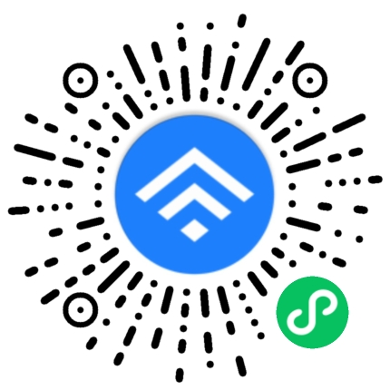

> [!IMPORTANT]
> 本项目是对稀土掘金 App 界面与部分功能的非官方微信小程序复刻，用于个人学习、技术研究和非商业公开展示。
>
> 本项目未获得稀土掘金官方授权、合作或认可，不是官方产品。本项目不得用于商业用途；以非商业形式发布不代表获得稀土掘金授权、合作或认可。

# 稀土掘金非官方小程序

本项目以稀土掘金 Android 版本为产品和视觉基准，通过原生微信小程序技术复刻部分页面、视觉效果与交互流程，用于学习微信小程序页面开发、组件设计、数据展示和交互实现。

本项目不是稀土掘金官方微信小程序。官方产品和服务请访问[稀土掘金官方网站](https://juejin.cn/)。

## 项目体验

推荐优先通过原生小程序源码或 H5 版本体验项目。你也可以直接观看小程序录屏，或通过微信体验当前已发布的历史版本。

### 1. 原生小程序源码（推荐）

拉取[项目源码](https://github.com/fthux/juejin)，使用微信开发者工具导入并预览，也可以通过真机运行开发版，体验原生微信小程序版本。

### 2. H5 版本（推荐）

访问由小程序转换生成的 [H5 版本](https://juejin.fthux.com/)，无需安装或配置开发环境，可直接在浏览器中体验。

### 3. 小程序录屏

不方便运行项目时，可以[观看小程序录屏](https://juejin.fthux.com/public/juejin-recoder.mp4)，快速了解主要页面和交互效果。

### 4. 线上小程序（历史版本）

微信扫描下方二维码，或在微信中搜索 **掘金学习版**。

> [!NOTE]
> 由于涉及社交类能力，线上版本曾多次未通过审核，因此当前可扫码体验的版本较旧，与仓库最新版可能存在差异。建议优先使用原生小程序源码或 H5 版本体验。

## 使用限制

本仓库允许个人为了非商业学习、技术研究和公开展示而阅读、下载、运行、修改、编译和发布许可范围内的原创代码。

以微信小程序、应用、网站或其他形式公开发布时，必须：

- 保留项目来源、许可协议和第三方权利声明
- 显著说明其为非官方、未授权的项目
- 遵守适用法律、平台规则和第三方权利要求
- 在发布前取得第三方材料的必要授权，或者删除、替换相关材料

未经许可，不得：

- 用于任何直接或间接的商业目的
- 用于企业内部业务、项目交付、收费教学、代开发或培训
- 通过广告、会员、赞助、捐赠、销售或导流获利
- 改名、换皮或以其他方式隐瞒项目来源，将其包装为完全自主原创产品
- 冒充稀土掘金官方产品或暗示获得官方授权
- 单独提取、打包、传播或销售项目中的第三方资源

完整条件以[个人学习与非商业展示用途代码许可协议](LICENSE)为准。

## 第三方权利

为学习和还原稀土掘金 App 的界面效果，本项目保留了必要的名称、Logo、图标、图片、界面元素及视觉素材。这些材料不属于本项目原创代码许可范围，本项目不主张对其享有著作权、商标权或其他知识产权，也不向使用者授予相关权利。公开发布版本是否可以继续使用这些材料，应由发布者根据授权情况自行判断并负责。

项目中引用的商标、标识、图片、文章、用户内容、第三方代码及其他材料，其权利归各自合法权利人所有。详细分类、使用限制和权利人联系机制请参阅[第三方权利声明](THIRD_PARTY_NOTICES.md)。

## 接口与账号安全

本项目没有获得稀土掘金官方 API 授权，不保证相关接口持续可用。请勿利用本项目批量抓取、镜像或重新分发平台内容，也不得绕过登录、付费、访问控制或反自动化措施。

小程序版本不提供账号登录，不收集手机号、密码或验证码，也不接入、模拟或绕过稀土掘金账号系统的身份验证和安全控制。需要登录、同步数据或使用创作功能时，请使用稀土掘金官方 App 或官方网站。

不得使用本项目收集、保存或上传他人的账号信息和个人数据。

## 许可协议

本项目不是开源软件，而是仅限个人学习、技术研究和非商业公开展示的源码公开项目。

项目维护者拥有授权权利的原创代码，仅依据[个人学习与非商业展示用途代码许可协议](LICENSE)提供有限许可。第三方材料不包含在该许可范围内，详见[第三方权利声明](THIRD_PARTY_NOTICES.md)。

Copyright (c) 2018-present fthux
